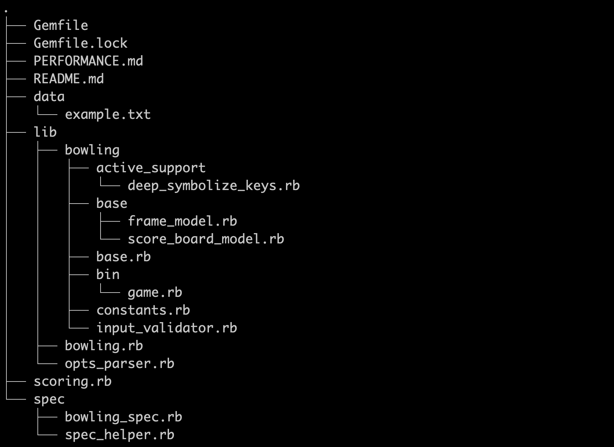

# Bowling scoring calculator

----

## Assumptions

* Each bowling game has 10 frames, with the last frame being a bonus frame consisting of up to 3 bowls

* When calculating the score, only frames that have been completed will be evaluated for the total score for a player so far

* The scoreboard can be printed onto the screen at any time, even before the game has ended

* The solution was designed for use as a CLI which receives arguments  

## Architectures



----

## Bonus

  > Represents possible extra frame composed by one or two tries if bowler score a spare or strik respectively in his last normal try.

## Testing

```bash
  rspec specs/
```

----

## Usage

Check data's folder to see valid values accepted. i.e

```bash
  ruby scoring.rb --pattern XXXXXXXXXXXX
```

----

## Automated Code reviews

[](https://houndci.com)